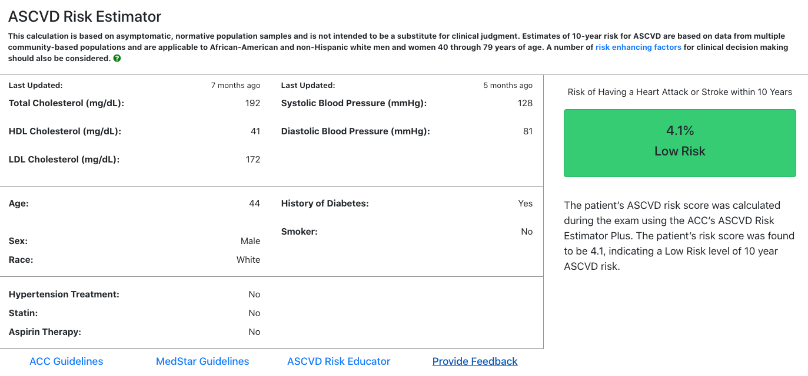

# Mobilizing Million Hearts

Mobilizing Million Hearts is a portable SMART On FHIR powered application to calculate and display the risk of having cardiac issues.



## Getting Started

### Configure your application

The application must be configured with the proper [SMART on
FHIR](http://www.hl7.org/fhir/smart-app-launch/#ehr-launch-sequence) information
in order to launch securely against your FHIR Server. Create a `.env` file in
the `app` directory with your application configuration before building. The
following variables are configurable.

| NAME                  | REQUIRED | DEFAULT VALUE |
| --------------------- | -------- | ------------- |
| CLIENT_ID             | yes      |               |
| SCOPE                 | yes      |               |
| ISS                   | yes      |               |
| REDIRECT_URI          | yes      |               |
| AUDITING              | no       | false         |
| ENABLE_DEVELOPERS_LOG | no       | false         |
| BLOODPRESSURE_CUTOFF  | no       | 5             |
| CHOLESTEROL_CUTOFF    | no       | 5             |

An example `.env` file might like this:

```sh
touch `app/.env`
```

```
CLIENT_ID=your-client-id
SCOPE=patient/Patient.read patient/Observation.read patient/MedicationOrder.read patient/MedicationStatement.read patient/MedicationAdministration.read patient/Condition.read patient/DocumentReference.read patient/DocumentReference.write
ISS=https://your-fhir-server/
REDIRECT_URI=http://where-your-app-is-deployed/
```

The server also offers some configuration to be more flexible in different situations. Create a `.env` file in the server directory.

```sh
touch `server/.env`
```

| NAME       | REQUIRED | DEFAULT VALUE               |
| ---------- | -------- | --------------------------- |
| DB_STORAGE | no       | ../../data/database.sqlite3 |
| NODE_ENV   | no       | development                 |

### How to Build and Run

This application is a modular Smart On FHIR application. The application that is
sent to the client lives in the `app` directory. The Smart On FHIR launch server
lives in the `server` directory.

You must create an application in a SMART on FHIR server such as [Cerner
Code](https://code.cerner.com/developer/smart-on-fhir/).

1. Create an App
2. Select the following scopes at a minimum:

   ```
   - patient/Patient.read
   - patient/Observation.read
   - patient/MedicationStatement.read
   - patient/Condition.read
   ```

3. Use `/launch.html` as the launch context
4. Use `/` as the Redirect URI
5. See [CONFIGURATION](docs/CONFIGURATION.md) on how to build your application with your App details
6. Serve the app using the included Express server:

   ```
   cd server
   yarn install
   yarn migrate
   yarn start
   ```

7. Build the application

```sh
yarn install
yarn build
```

8. Launch the App from a SMART on FHIR portal

Because this app is a compiled React SPA, you must rebuild it on
any change to the code. The server is configured to have its public path
in the build location.

### Or: Use docker-compose

```
docker-compose up
```

### Or: Use docker

```sh
NODE_ENV=development docker build -t hearts .
```

```sh
docker run -p 3000:3000 hearts
```

### SQLite

The application uses SQLite to persist some usage information when AUDITING is
enabled. If you need access to this data, consider mounting a volume when
running the application:

```
mkdir data
docker run -p 3000:3000 -v data:/usr/src/app/data hearts
```

## Read more

- [Documentation](./docs/INDEX.md)
